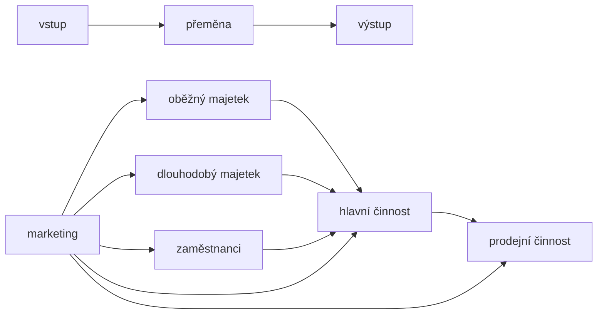
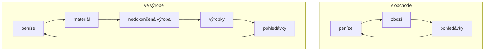

# Majetek podniku #ekonomika #EKO

### Výrobní faktory

> Slouží jako vstupy do hlavní podnikatelské činnosti

> **[[#Oběžný majetek]]** jednorázový materiál
> **[[#Dlouhodobý majetek]]** delší doba *stroje, budovy*
> **Zaměstnanci** výrobní faktor práce

### Pořízení vstupů

> Vstupy potřebné k podníkání je třeba získat/nakoupit:
> - **Vlastní zdroje** počáteční vklad/zisk
> - **Cizí zdroje** úvěry

## Oběžný majetek

> mění svou podobu a často se spotřebovává jednorázově *materiál*

#### Koloběh oběžného majetku

### Druhy

#### Krátkodobý finanční majetek

> Doba použitelnosti **méně** než **1 rok**
> 
> **Peněžní prostředky** v hotovosti a na účtech
> **Ceniny** majetek představující určitou hodnotu *poštovní známky, kolky, stravenky, dobíjející karty*
> **Cenné papíry** představují určitou hodnotu a jejich splatnost je jeden rok *směnka*

#### Pohledávky

> Představují nárok na úhradu peněžní částky od dlužníka
> Pohledávky za odběrateli za prodané statky a služby

#### Zásoby

> Majetek, který po určitou dobu ukládáme do skladů> 

> Výrobky
> - předměty vyráběné s cílem prodat je odběratelům
> 
> Zboží
> - věci koupené za účelem dalšího prodeje

## Dlouhodobý majetek

> Používá se dlouhou dobu, většinou **déle** než **1 rok**
> Během užívání neztrácí původní formu
> Postupně se opotřebovává

> **Výstupní cena**[^1] zahrnuje kupní cenu majetku a náklady spojené s pořízením *doprava, monžáž, instalace*
> Způsoby stanovení vstupní ceny:
> - Vlastní náklady[^2]
> - Reprodukční cena[^3]

[^1]: Pořizovací cena
[^2]: Získání majetku vlastní výrobou
[^3]: Používá se v případě darování majetku.
			Tato cena vyjadřuje jakou má hodnotu tento majetek dnes

### Druhy

#### Hmotný

> Nemovitné a movitné věci
> Vstupní cena[^1] **vyšší** než **40 000 Kč** *budovy, sklady, stroje, auta*

#### Nehmotný

> Nehmotné statky
> Vstupní cena[^1] **vyšší** než **60 000 Kč** *patenty, licence, autorská práva, software, know-how*

#### Finanční

> Pořízen za účelem dosažení výnosu
> *Akcie, dluhopisy, úvěry*

#### Drobný majetek

> Movitné věci
> Vstupní cena **nižší** než **40 000 Kč** *notebook, stoly, židle, tiskárny*
> Podnikatel má právo se **rozhodnout** zda drobný majetek bude **oběžný** nebo **dlouhodobý**

### Plánování investic

> Vynaložení prostředků tak, aby přinášely další výnos
> Náklady na pořízení dlouhodobého majetku, o kterých překpokládáme, že se vrátí ziskem
> *Pořízení strojů, výrobních hal, technologií, licencí, akcií*

> #### Způsoby pořízení investic
> 
> Vlastní činností
> Nákup
> Vklad majetku vloženého společníky do obchodní společnosti
> Bezúplatné nabytí

#

